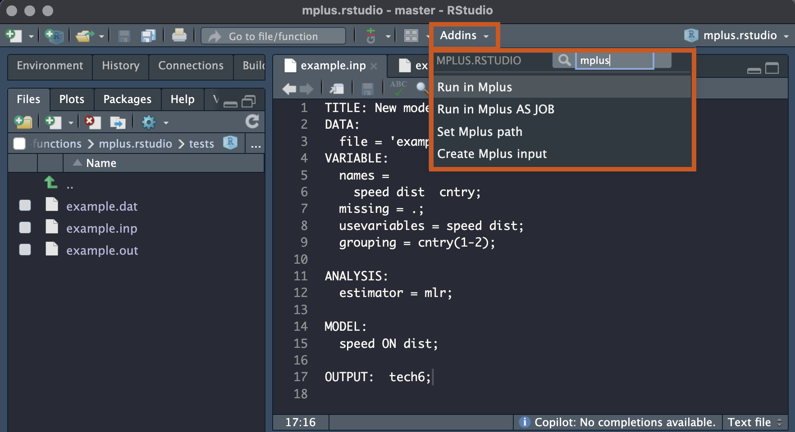

# mplus.rstudio

Addin for Rstudio allowing to run Mplus code within RStudio (Mplus license and installed Mplus are required).

## Installation

Run once

```         
devtools::install_github("maksimrudnev/mplus.rstudio")
```

After the installation is done, you will find four commands in your RStudio Addins menu under header "MPLUS.RSTUDIO" (no need to load the library).



## Usage

-   **Run in Mplus** Open an Mplus input file (make sure it is active, that is, just click on the code), click "Run in Mplus" and it will run. If it's not running, try setting up a path to the Mplus executable file, or a command that refers to it. On the click "Run in Mplus" saves the input file, and after running the code, it automatically opens the output file. You can see the progess in the console.

-   **Run in Mplus as Job** Same as Run in Mplus but instead it send the task to the Background Jobs, so you can still use RStudio (including starting other Mplus models) while the current Mplus process is being executed. I find it especially handy and, in fact, use it as a default.

> **NB!** Add it to shortcuts and make running Mplus even more handy: Go to *Tools -\> Modify Keyboard Shortcuts*, find in there "Run in Mplus" or "Run in Mplus as Job" and assign a custom shortcut (for example, I use Control+R on my Mac).

-   **Set Mplus path** Tell RStudio where to find Mplus executable file. The default is just "mplus" and in most cases it works. If it doesn't, use this command to set it, and it will be stored within current R project or globally if you work outside any project.

-   **Create Mplus input** This command creates a template code for the new analysis, saves a data.frame in Mplus-compatible format, and opens the code in RStudio.
